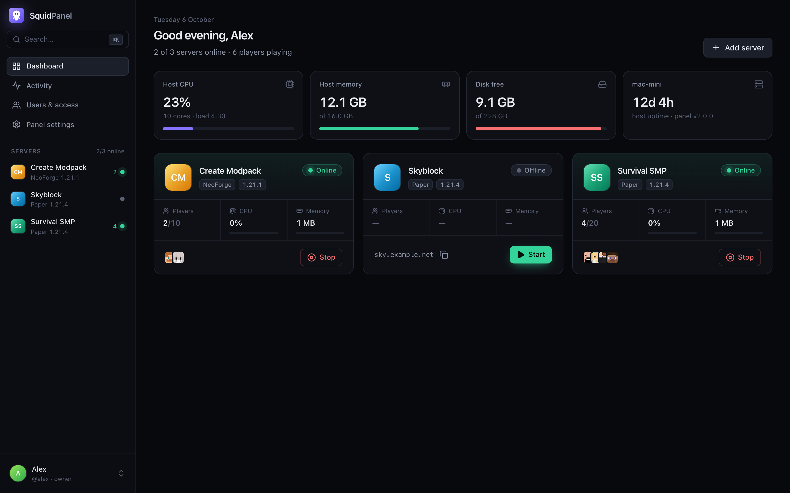
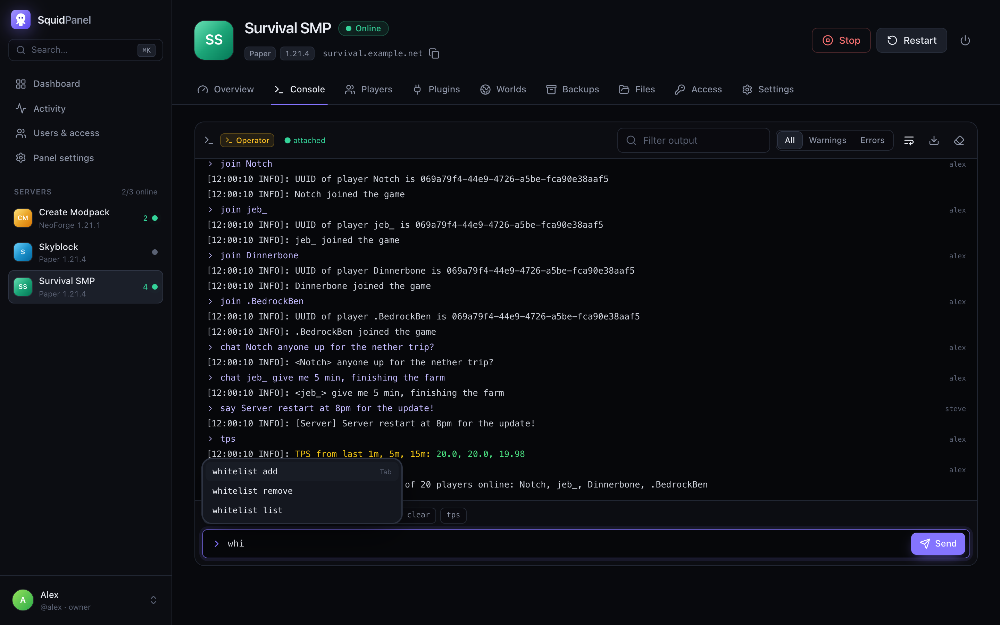
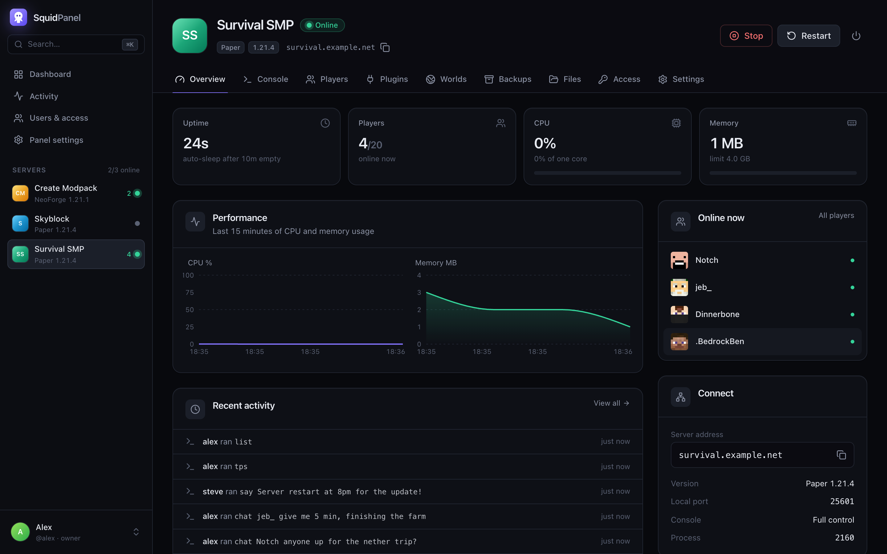
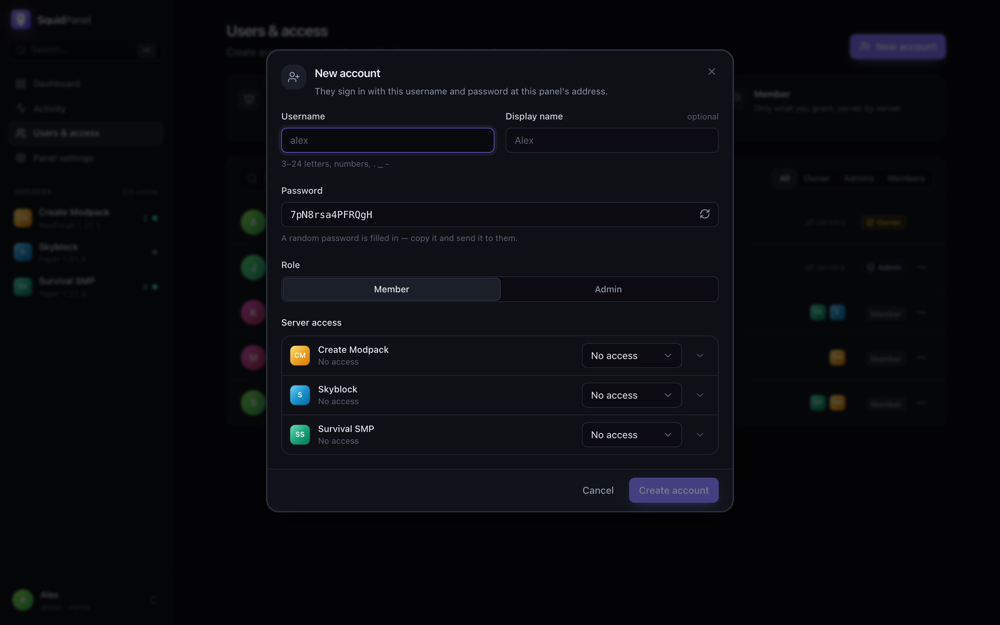
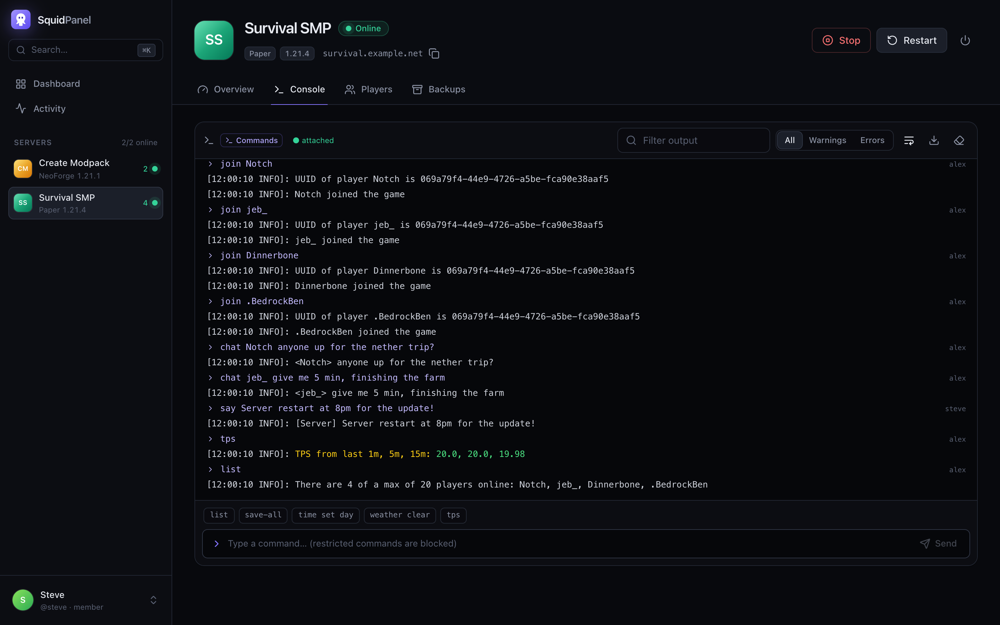
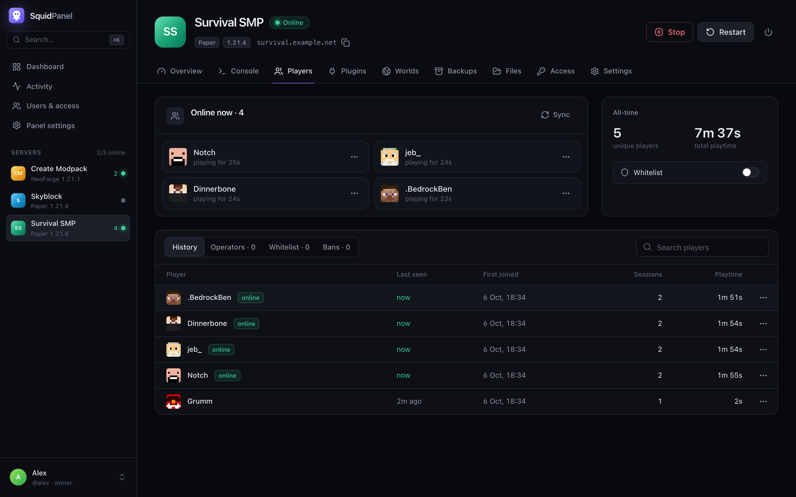
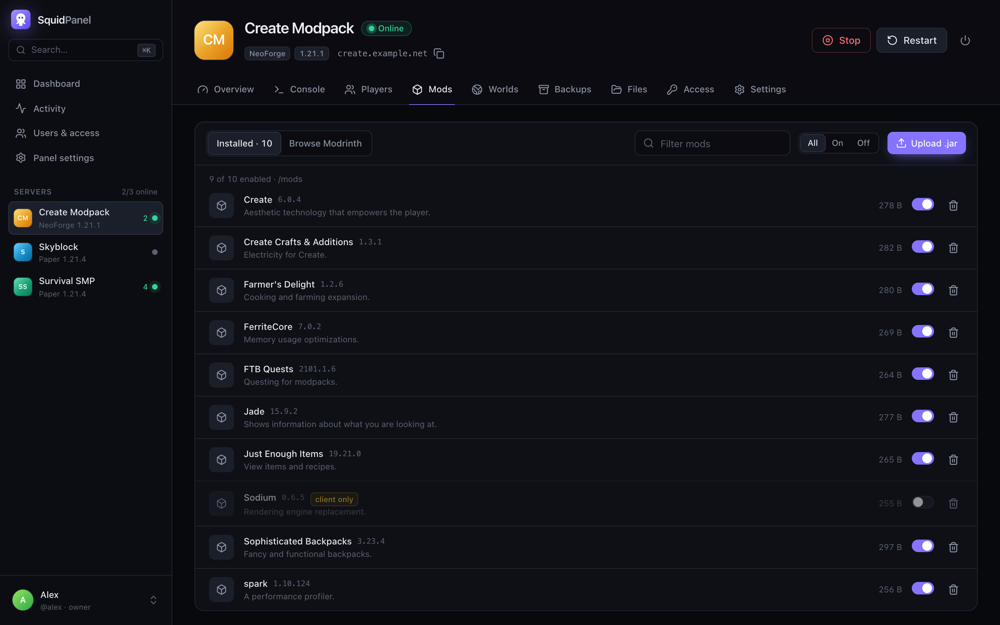
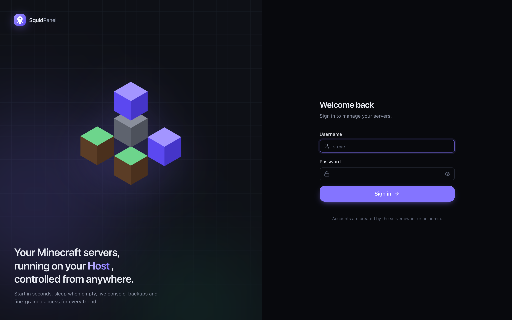
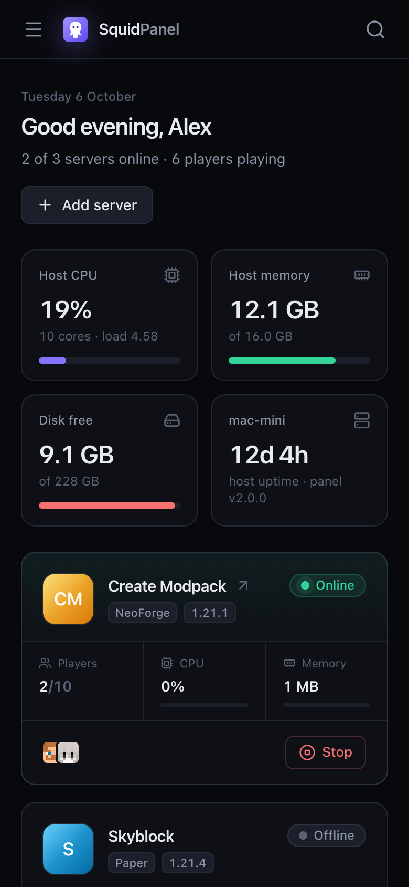
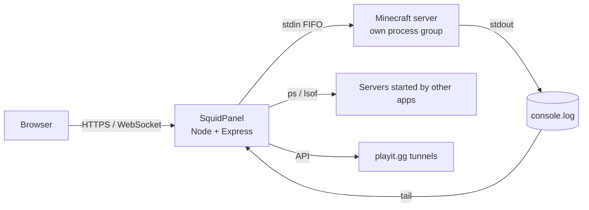

<div align="center">


# SquidPanel

**A self-hosted control panel for the Minecraft servers on your own machine.**

Start in seconds, sleep when nobody is playing, run the live console from your phone,<br/>
and give each friend exactly the access you want.




</div>

---

Hosting Minecraft on your own computer is free and fast, but managing it is not. You have to leave a terminal open, remember to stop the server, and share your whole machine just so a friend can restart it.

SquidPanel is a single, always-on web panel that does that work for you. It works like Aternos-style hosting, except the servers run on hardware you own.

## Features

**Run servers**
- Start, stop, restart and force-kill servers. They start in seconds, with no queue.
- **Sleep when empty**: a server stops itself after N minutes with no players.
- Optionally start with the computer, and restart after a crash (with a loop guard).
- Picks the right Java automatically per Minecraft version (Java 25 for 26.x, Java 21 for 1.20.5–1.21.x, Java 17, 8…).
- Keeps the Mac awake while a server runs, and lets it sleep normally otherwise.

**Live console**
- Colored, streaming output with warnings/errors filters, search and download.
- Command history (↑/↓), Tab completion, quick commands, and *who ran what*.
- The console survives panel restarts and keeps working without interruption.

**People and permissions**
- Owner, Admin and Member roles, plus per-server grants for members.
- Console access in four levels: **none · read-only · commands · operator**.
- Restricted commands (such as `op`, `stop`, `ban`, `execute … run op`) are blocked below operator level.
- Members can re-share access, but never more than they have themselves.
- Suspend accounts, reset passwords, sign out sessions, and keep a full activity log.

**Manage content**
- **Players**: who's online, history with sessions and playtime, and kick/ban/op/whitelist.
- **Mods and plugins**: real names and versions read from the jars, enable/disable switches, and one-click [Modrinth](https://modrinth.com) install. Installs are filtered to your loader and game version, and required dependencies come along.
- **Worlds**: switch, upload, download and delete. Nether and End folders stay together.
- **Backups**: consistent backups (save-off and save-all while running), schedules with retention, restore and download.
- **Files**: a browser with an editor (⌘S), drag-and-drop upload, and folder download as zip.
- **Settings**: a typed `server.properties` editor that keeps your comments, plus memory, Java and launch options.

**Everywhere**
- A responsive UI that works on phones, a ⌘K command palette, and live updates over WebSocket.
- Detects servers started by other apps and shows them too.
- Optional [playit.gg](https://playit.gg) integration: tunnels open while a server runs and close when it stops.

## Screenshots

| | |
|---|---|
|  **Live console**: streaming output, history, completion, and who ran each command |  **Overview**: uptime, sleep countdown, CPU and memory charts, players |
|  **Accounts**: create a friend's login and pick access per server |  **Member view**: only the tabs they were granted, with a "Commands" console |
|  **Players**: online now, history, playtime, moderation |  **Mods and plugins**: real metadata, toggles, Modrinth |
|  **Sign in** |  **Phone friendly** |

## Requirements

| | |
|---|---|
| **OS** | macOS 13 or later (developed on Apple Silicon). The core also runs on Linux, but the service scripts and a few niceties (`caffeinate`, `vm_stat`) are macOS-only. |
| **Node.js** | 20 or newer: `brew install node` |
| **Java** | Whatever your servers need. `brew install --cask temurin@21` covers 1.20.5–1.21.x, and `temurin@25` covers 26.x. SquidPanel finds every JDK installed on the machine. |
| **Servers** | Any folder with a server jar or a `run.sh` start script plus `server.properties`: Paper, Purpur, Spigot, Vanilla, Fabric, Forge or NeoForge. |

## Quick start

```bash
git clone https://github.com/siddhjagani/SquidPanel.git
cd SquidPanel
npm install
npm run service:install
```

This builds the UI and installs SquidPanel as a **login service**. It starts automatically when you log in and restarts itself if it ever stops.

1. Open **http://localhost:3333** on that machine and create the **owner** account. For safety, the first account can only be created from the machine itself, never over the network.
2. SquidPanel imports any server folders it finds in `~/SquidServers`. Add other locations or single servers under **Panel settings → Add servers**.
3. Create accounts for friends under **Users & access**, and choose what each one can do on each server.

> Want to try it without installing a service? Run `npm run build && npm start`.

## Accounts & permissions

| Role | Can do |
|---|---|
| **Owner** | Everything, including creating and managing admins. There is exactly one owner. |
| **Admin** | Every server, including launch settings. Can create and manage member accounts. |
| **Member** | Only what is granted, server by server. |

**Console access** (per member, per server):

| Level | What they can do |
|---|---|
| No access | The console tab is hidden. |
| Read only | Watch the live console. |
| Commands | Run commands, except restricted ones. The restricted list is editable per server. |
| Operator | Run any command. |

**Permissions:** start · stop/restart/kill · view players · kick/ban/whitelist · file manager · mods & plugins · worlds · backups · server settings · share access.
**Presets:** Viewer, Player, Moderator and Co-admin, so most people take one click to set up.

## Access from anywhere

The panel listens on port `3333`. To reach it from outside your network, put it behind HTTPS. Two good options:

**Cloudflare Tunnel** (recommended: no port forwarding, and your home IP stays hidden):

```bash
brew install cloudflared
cloudflared tunnel login                # pick your domain
scripts/install-tunnel.sh panel.example.com
```

This creates a dedicated tunnel, adds the DNS record, and installs an always-on service.

**Any reverse proxy** (Caddy, nginx, Tailscale Funnel…): proxy to `http://127.0.0.1:3333`, and allow WebSocket upgrades on `/ws`.

Sign-in is always required. Sessions use HTTP-only cookies (marked `Secure` behind HTTPS), state-changing requests need a CSRF header, failed logins are rate-limited, and owner setup is refused for proxied requests.

## Letting friends join (playit.gg)

Players need a way into your network, through port forwarding or a tunnel. If you already use **playit.gg** through the [SquidServers](https://squidservers.com) app, SquidPanel picks up that agent key automatically and does the job itself:

- it keeps the playit agent running, even with the SquidServers app closed;
- it opens each server's tunnel while the server runs and closes it when it stops (matched by port);
- it shows the playit address as the server's join address.

If the SquidServers app is already running its own agent, SquidPanel reuses it instead of starting a second one. You can turn this off under **Panel settings → playit.gg tunnels**.

## How it works



- **Servers outlive the panel.** Each server runs in its own process group. Output goes to a log file, and input comes through a named pipe (FIFO) that a tiny shell wrapper holds open, so the server never sees end-of-input. If the panel restarts, it re-attaches to running servers, including their consoles.
- **Other apps are detected.** Java processes whose working directory matches a server folder are adopted. Their console is read-only unless RCON is enabled, which takes one click in Settings.
- **Backups don't freeze the panel.** They use the native `zip`/`unzip` tools, so even multi-gigabyte worlds never block the panel. On restore, current world folders are moved to a trash folder rather than deleted.
- **One small store.** Everything is kept in `data/panel.json`, written atomically. There is no database to run.

## Configuration

| Variable | Default | |
|---|---|---|
| `PORT` | `3333` | HTTP port |
| `HOST` | `0.0.0.0` | Bind address. Use `127.0.0.1` to allow only local and tunnel access. |
| `SQUIDPANEL_DATA` | `./data` | Where accounts, history, backups and logs live |
| `SQUIDPANEL_HOST_LABEL` | machine name | Name shown on the dashboard's host card |

To change them for the service, edit `scripts/install-service.sh` (or `~/Library/LaunchAgents/com.squidpanel.panel.plist`) and run `npm run service:install` again.

**Back up `data/`.** It holds accounts, player history, activity and panel backups, and it is git-ignored on purpose.

## Commands

| Command | |
|---|---|
| `npm run service:install` | Build and install (or update) the login service |
| `npm run service:restart` | Restart the panel. Running servers are unaffected. |
| `npm run service:logs` | Follow the logs in `~/Library/Logs/SquidPanel` |
| `npm run service:uninstall` | Remove the service |
| `npm run reset-password -- <user> <password>` | Recover an account |
| `npm run create-owner -- <user> <password>` | Create the owner from the terminal |
| `npm run list-users` | List accounts |

The account commands pause the service while they edit the data, then start it again.

## Troubleshooting

<details>
<summary><b>"Port 25565 is already in use"</b></summary>

Another server, or another app, is using that port. Stop it there, or change `server-port` in **Settings → Game rules**.
</details>

<details>
<summary><b>The console is read-only</b></summary>

The server was started by another app. Stop it and start it from SquidPanel, or enable RCON in **Settings → Console safety** (admins only).
</details>

<details>
<summary><b>Nothing starts after a reboot</b></summary>

With FileVault enabled, macOS waits at the login screen until someone unlocks the disk. Once you log in, the panel starts automatically. For planned reboots, `sudo fdesetup authrestart` skips that prompt once.
</details>

<details>
<summary><b>"Unsupported class file major version" / the server crashes on start</b></summary>

The server needs a newer Java. Install it (for example `brew install --cask temurin@25`). SquidPanel picks it up automatically, or you can choose one under **Settings → Launch & memory**.
</details>

## Development

```bash
npm install
npm start          # API + built UI on :3333
npm run dev        # Vite dev server on :5173, proxies /api and /ws to :3333
npm run lint && npm run build
```

```
server/            Express API, WebSocket, process manager
  manager.js       start/stop, FIFO console, log tailing, idle/crash handling, adoption
  rbac.js          roles, grants, console levels, restricted commands
  backups.js       zip-based backups, schedules, restore
  playit.js        playit.gg agent + tunnel switching
  routes/          REST endpoints (account, users, servers, content, system)
src/               React 19 + Tailwind UI
  pages/           Dashboard, server tabs, Users, Activity, Settings, Account
  components/      UI kit (ui.tsx), domain components, app shell
scripts/           launchd service, Cloudflare tunnel, account recovery
```

---

<sub>SquidPanel is an independent project. It is not affiliated with Mojang Studios, Microsoft, SquidServers, playit.gg or Cloudflare. Minecraft is a trademark of Mojang Studios.</sub>
